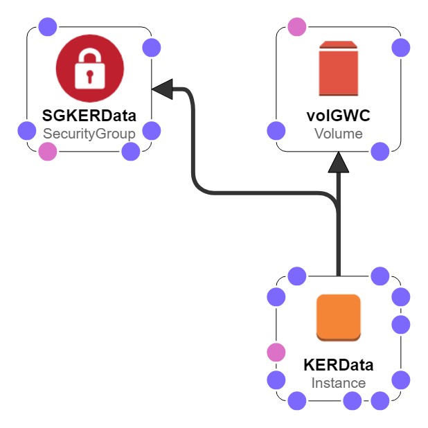

# geonode_install
Install CityData 2.8 using Ansible.



## Pre-requisites
Ansible control machine running:
* boto3
* ansible 2.6 or greater

Check if boto3 is installed:  
```bash
python -c "import boto3"
```
If this gives no output message, boto3 is installed.

If needed, install boto3:  

```bash
pip install boto3
```

Check Ansible version:  
```bash
ansible-playbook --version
```

If version 2.6 or later is not installed, install/upgrade Ansible:  
```bash
sudo apt update
sudo apt upgrade
sudo apt install software-properties-common
sudo apt-add-repository ppa:ansible/ansible
sudo apt update
sudo apt install ansible
```

## Create AWS key pair

On the AWS EC2 Console, under **NETWORK & SECURITY > Key Pairs**:  
* Create a key pair called `CityData`

Download and save the pem file.

If working on Windows, use PuTTYGen to convert the pem to a ppk for use in PuTTY.

## Create AWS Secret Key

On the AWS Console, go to IAM and navigate to Users > you.

Go to the Security credentials tab and then to the Access keys section.

Create an Access Key and record the Access Key ID (aws_access_key) and secret key (aws_secret_key).

## Create Django Secret Key

Generate a new strong 32-character password (e.g. in Password Safe) for your Django Secret Key (django_secret_key).

## Create Geonode admin password

Generate a new strong 12-character password (e.g. in Password Safe) for your Geonode admin password (admin_pass).

## Encrypt variables with Ansible Vault

Generate a new Ansible Vault password for your project.

Save the new Ansible Vault password in your personal password safe.

Using the new Ansible Vault password, encrypt and save the following variables in the following files:

* **group_vars/all**: github_passwd, aws_secret_key, aws_access_key, django_secret_key
* **group_vars/dev**: admin_pass

## Set network and organisational variables

In the `group_vars/all` file set the region to the AWS region e.g. us-west-1

Duplicate the `group_vars/cityfutures` file to a new file named for the organisation assoicated with this project, e.g. `asu`. Edit the new file to set details for your organisation and project. Use the new filename as a section header in your inventory files in place of `cityfutures`.

In the group_vars file for your environment (e.g. `group_vars/dev`) set the VPC ID and Subnet ID:

```yml
vpc_id: vpc-12345678
subnet_id: subnet-12345678
```

Comment out the prv_ip and assign_prv_ip variables:

```yml
prv_ip: # Private IP address of api server

# Leave these blank for first time stack creation.
# Then store IP addresses above and uncomment the assignment below
assign_prv_ip: # '"PrivateIpAddress": "{{ prv_ip }}",'
```

## Create stack

Now create the stack, including EC2 instance, volumes and security group:

```bash
ansible-playbook stack.yml -i localhost_ENV --ask-vault-pass
```
where ENV = dev, test or prod. E.g. localhost_test

When prompted, enter the Ansible vault password for your project.

If successful this step will print the private IP address, and if available the public IP address, of the CityData EC2 instance created.

Copy the private IP address into the relevant inventory and group_vars files for the environment you are creating (dev, test or prod).

If available, use the public IP address for connecting with PuTTY (below), otherwise use the private IP address to connect through a VPN.

## Prepare the EC2 instances

### Authorise the control machine to SSH to the server

Use PuTTY or similar to SSH from your laptop into the new CityData server. You will need a local copy of the key file CityData.ppk (or CityData.pem for Macs).

For PuTTY use the following settings:  
* Session > Host name: *CityData's private IP* (or public IP if no VPN is used)
* Session > Connection type: SSH
* Connection > Seconds between keepalives: 120
* Connection > Data > Auto-login username: ubuntu
* Connection > SSH > Auth > Private key file for authentication: *path/to/CityData.ppk*

The first time you SSH to the new server you will be asked to confirm.

On the Ansible control machine:
```bash
cat ~/.ssh/id_rsa.pub
```

Copy the content of id_rsa.pub to your clipboard.

On the CityData server:
```bash
vi ~/.ssh/authorized_keys
```
Paste from the clipboard to a new line at the end of the file.

Now test the connection. On the Ansible control machine:
```bash
ssh <CityData private IP>
```

You will see a warning that the authenticity of the host can't be established.

Type `yes` when prompted to permanently add the IP address of the CityData server to the list of known hosts.

You should now be logged into the CityData server.

Type `exit` to return to the Ansible control machine.

### Prepare the server

The `prep.yml` playbook sets the hostname and timezone and installs python2.7 on both servers. It then mounts the large disk on the CityData server and installs Nodejs on the NODE server.

Make sure your inventory file (dev, test or prod) contains the IP addresses of the server.

Run the playbook with:

```bash
ansible-playbook prep.yml -i ENV_py3
```

where ENV = dev, test or prod.

#### Timout error

If you see:  
```
TASK [prep_server : Set hostname] **********************************************
fatal: [10.116.2.8]: FAILED! => {"msg": "Timeout (12s) waiting for privilege escalation prompt: "}
        to retry, use: --limit @/home/ubuntu/ansible/geonode_install/prep.retry
```

This means the server is timing out trying to set the hostname because the current hostname is not recorded in `/etc/hosts`.

Easiest response is to SSH into your new server and:  

1. Click on the current hostname which will be part of your shell prompt, e.g. the **bold** part of the prompt string below:

  > ubuntu@**ip10_116_2_8**:~$

2. Edit the hosts file with `vi`:

  ```
  sudo vi /etc/hosts
  ```

3. Once in `vi`, add (or change) second line to:  
```
127.0.1.1 CityData-ENV
```

where ENV is your target environment: dev, test or prod.

## Install CityData

```bash
ansible-playbook geonode.yml -i ENV_py2 --ask-vault-pass
```
where:  
* ENV = dev, test or prod

#### Install complete

If you see the message below, you''ve installed CityData and can now test the endpoints and continue configuration (below):

`Geonode installed on http://YOUR_IP_ADDRESS`

where YOUR_IP_ADDRESS is the IP address of the server.

# Configuration

## Configure Geoserver

Now login to http://`YOUR_IP_ADDRESS`/geoserver as admin using the Geoserver admin password.

Change Master Password db store password in:  
* Security > Passwords > Active master password provider > Change password
